<p align="center" style="margin-bottom:10px;margin-top:10px;">


</p>

<h2 align="center">
 <b style="font-size:24px;line-height:24px;vertical-align:middle;"><i>Eugene  dotfiles</i></b>
</h2>

<p align=center style="margin-top:36px">	  
  
  
  
  
    
</p>

<p align="center"><b>This dotfiles includes the following tools config</b></p>
<p align="center">


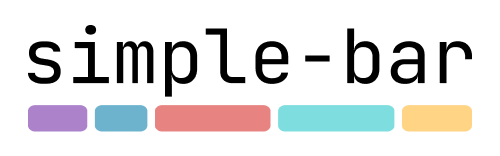

</p>
<p align="center">
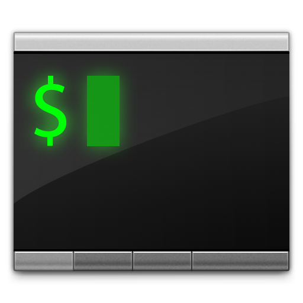

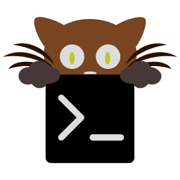
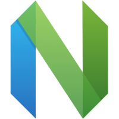
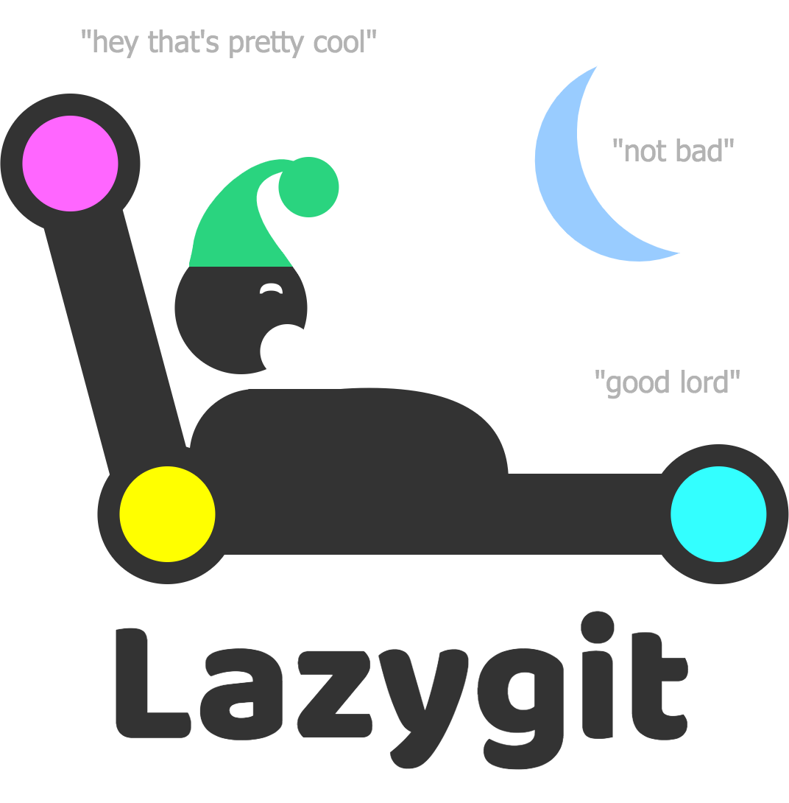


</p>
<p align="center">

</p>

<p align="center"><b>Show My Favorite Desktop</b></p>

<p align="center">

</p>

### 🧑🏾‍🎨 ScreenShot

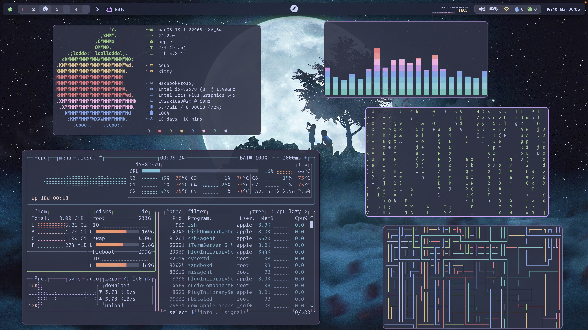

<details>
<summary><b>Load More</b> <span style="font-size:14px;">(Click to expend) </span> </summary>

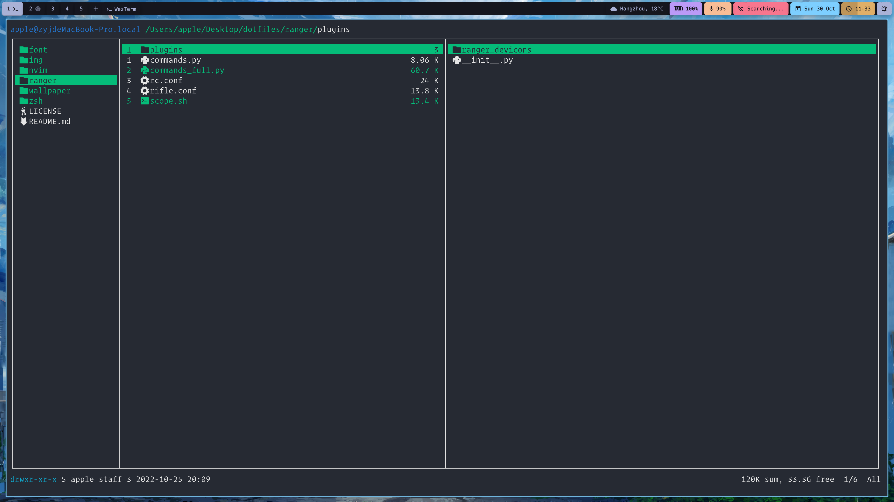

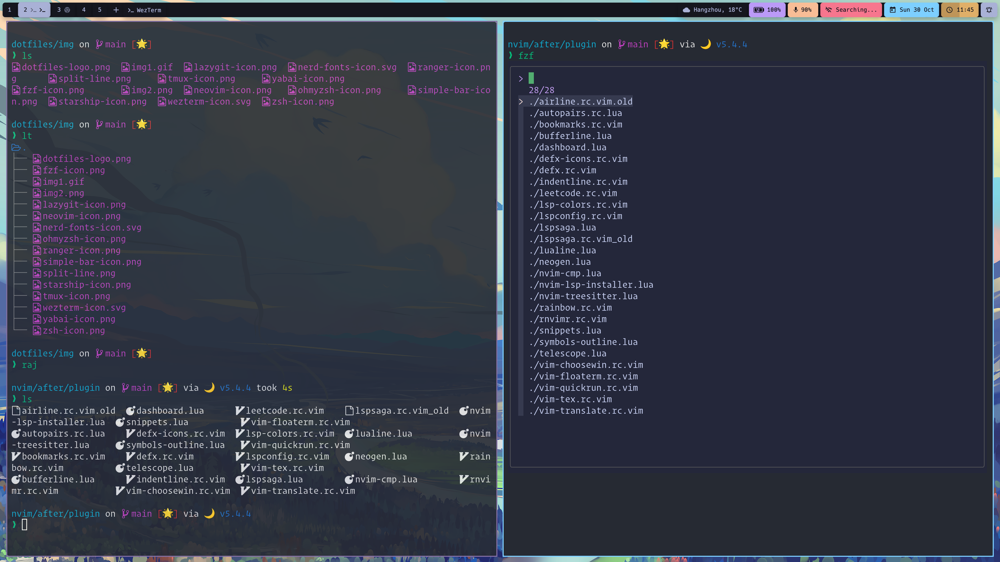

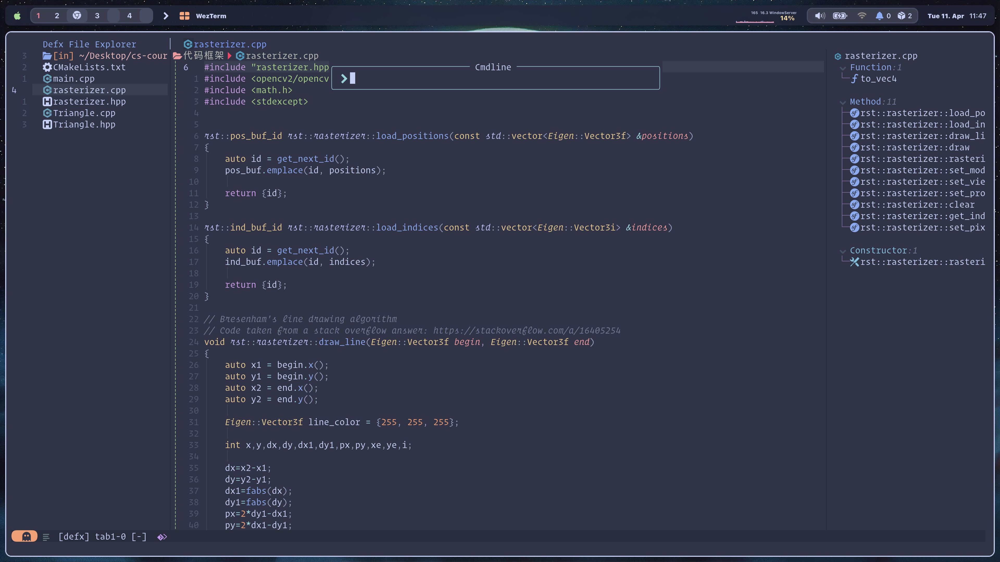

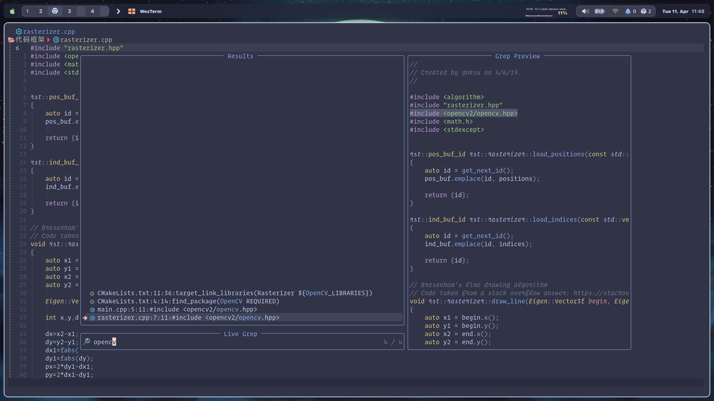

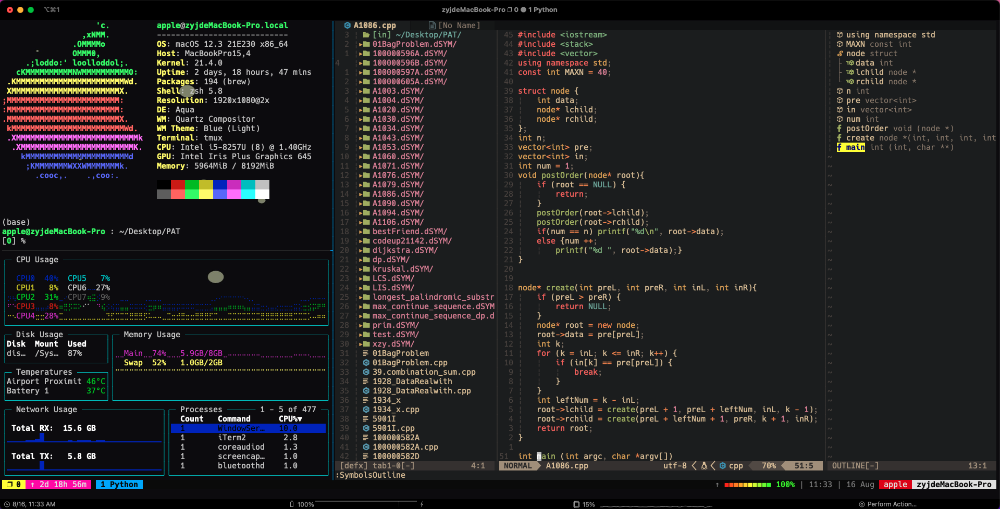


</details>


### 🗒️ Info

This config folder include all my environment in My OS(Just cherry pick the piece of code you totally understand).

- Terminal [`Wezterm`](https://github.com/wez/wezterm) [`kitty`](https://github.com/kovidgoyal/kitty) [`iterm2`](https://github.com/gnachman/iTerm2)
- Shell [`zsh`](https://www.zsh.org/)
- Shell Framework [`ohmyzsh`](https://github.com/ohmyzsh/ohmyzsh)
- Shell Theme [`starship`](https://github.com/starship/starship)
- File Management Tool [`ranger`](https://github.com/ranger/ranger)
- Fuzzy Finder Tool [`fzf`](https://github.com/junegunn/fzf)
- Ls Beautification Tool [`lsd`](https://github.com/Peltoche/lsd)
- Font [`HackNerdFont`](https://github.com/ryanoasis/nerd-fonts) [`JetBrainsMono`](https://github.com/JetBrains/JetBrainsMono) [`OperatorMono`](https://www.typography.com/fonts/operator/styles/multi) 
- Theme [`Catppuccin`](https://github.com/catppuccin/catppuccin) 
- Browser [`Chrome`](https://www.google.com/) [`qutebrowser`](https://github.com/qutebrowser/qutebrowser)
- The Hacker's Browser Plugin [`vimium`](https://github.com/philc/vimium)
- System Information Tool [`neofetch`](https://github.com/dylanaraps/neofetch)
- Terminal Git Tool [`lazygit`](https://github.com/jesseduffield/lazygit)
- File Editor Tool [`neovim`](https://github.com/neovim/neovim)
- Terminal Multiplexing Tool [`tmux`](https://github.com/tmux/tmux)
- Windows Management Utility [`yabai`](https://github.com/koekeishiya/yabai)
- Simple Hotkey Daemon [`skhd`](https://github.com/koekeishiya/skhd)
- Status Bar [`sketchybar`](https://github.com/FelixKratz/SketchyBar)
- Music Player [`Spotify`](https://www.spotify.com/us/download/mac/)
- Spotify Client [`spotify-tui`](https://github.com/Rigellute/spotify-tui) [`spicetify`](https://github.com/spicetify/spicetify-cli)
- Cross-platform Audio Visualizer[`cava`](https://github.com/karlstav/cava)
- PDF Viewer [`zathura for MacOS`](https://github.com/zegervdv/homebrew-zathura) or [`zathura`](https://github.com/pwmt/zathura)
- Application Launcher [`Alfred`](https://www.alfredapp.com/)
- System resource monitor [`btop`](https://github.com/aristocratos/btop)
- Cat with syntax highlighting and Git integration [`bat`](https://github.com/sharkdp/bat)

### 🔨 Dependencies
#### 📦 Packages

``` bash
brew install --cask kitty
brew install --cask iterm2
brew install --cask wezterm
```

<details>
<summary><b>Load More</b> <span style="font-size:14px;">(Click to expend) </span> </summary>

#### ✍️ Fonts

```
brew tap homebrew/cask-fonts
brew install --cask font-hack-nerd-font
brew tap homebrew/cask-fonts
brew install --cask font-jetbrains-mono
bash ubuntu_install.sh
```

#### 🐚 zsh

```
brew install ranger
brew install lsd
brew install fzf
brew install starship
brew install zsh
sh -c "$(wget -O- https://raw.githubusercontent.com/ohmyzsh/ohmyzsh/master/tools/install.sh)"
```

#### 🎵 Music

```
brew install --cask background-music
brew install cava
brew install --cask spotify
brew install khanhas/tap/spicetify-cli
brew install spotify-tui
```

#### 🦇 Yabai & skhd 

```
brew install koekeishiya/formulae/yabai
brew install koekeishiya/formulae/skhd
```

#### 🌥️sSktchybar

```
brew tap FelixKratz/formulae
brew install sketchybar
brew install jq
brew install gh
brew install switchaudio-osx
brew install --cask sf-symbols
curl -L https://github.com/kvndrsslr/sketchybar-app-font/releases/download/v1.0.4/sketchybar-app-font.ttf -o $HOME/Library/Fonts/sketchybar-app-font.ttf
```

#### 🤿 Neovim & Tmux

```
brew install llvm
brew install ripgrep
brew install neovim
brew install tmux
```

#### Other 

```
brew install --cask alfred
brew install bat
brew install btop
brew install lazygit
brew install neofetch
brew install --cask qutebrowser
```

</details>

### 🚀 Manual Installation

1.Clone this repository.

```
git clone https://github.com/command-z-z/dotfiles
```

2.See my `install.sh` to learn more about my config.

3.Install the required software(see [Dependencies](#-dependencies)) or run `install.sh` script.

```
./install.sh
```

4.Just copy the piece of code you really want.

### 🤖 Notes
neovim python dependencies.
```
pip install neovim
pip install pyvim
pip install Ranger-fm
```
