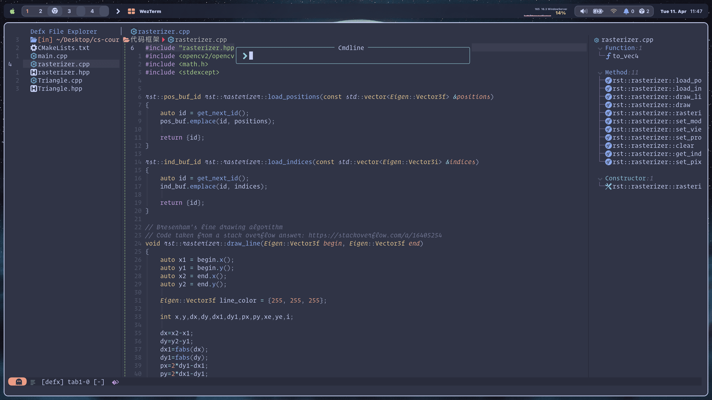

<p align="center" style="margin-bottom:10px;margin-top:10px;">


</p>

<h2 align="center">
 <b style="font-size:24px;line-height:24px;vertical-align:middle;"><i>Eugene  dotfiles</i></b>
</h2>

<p align=center style="margin-top:36px">	  
  
  
  
  
    
</p>

<p align="center"><b>This dotfiles includes the following tools config</b></p>
<p align="center">


</p>
<p align="center">


</p>
<p align="center">

</p>

<p align="center"><b>Show My Favorite Wallpaper</b></p>

<p align="center">

</p>

### 🧑🏾‍🎨 ScreenShot


<details>
<summary><b>Load More</b> <span style="font-size:14px;">(Click to expend) </span> </summary>





</details>


### 🗒️ Info

this config folder include all my environment in My OS.

- Terminal [`Wezterm`](https://github.com/wez/wezterm)
- File management tool [`ranger`](https://github.com/ranger/ranger)
- Shell [`zsh`](https://www.zsh.org/)
- Shell framework [`ohmyzsh`](https://github.com/ohmyzsh/ohmyzsh)
- Shell theme [`starship`](https://github.com/starship/starship)
- File find tool [`fzf`](https://github.com/junegunn/fzf)
- Ls beautification tool [`lsd`](https://github.com/Peltoche/lsd)
- Terminal git tool [`lazygit`](https://github.com/jesseduffield/lazygit)
- File editor tool [`nvim`](https://github.com/neovim/neovim)
- Terminal multiplexing tool [`tmux`](https://github.com/tmux/tmux)
- Tmux framework [`ohmytmux`](https://github.com/gpakosz/.tmux)
- Windows management utility [`yabai`](https://github.com/koekeishiya/yabai)
- Simple hotkey daemon [`skhd`](https://github.com/koekeishiya/skhd)
- A yabai status bar [`simple-bar`](https://github.com/Jean-Tinland/simple-bar)

### 💡 Tutorial

And i will also write some tutorial in my blog

- []()

### 🔨 Dependencies
#### Packages
#### Fonts

### 🚀 Manual Installation

# Brew packages
```
brew install fzf the_silver_searcher ripgrep fd
brew install automake wget gcc gdb bat ccat tree git-delta git-flow git rainbarf jsdoc3 cmake gnu-getopt gnu-sed node go
brew install ccls tmux neovim jesseduffield/lazygit/lazygit
brew install awscli gh tldr
brew install speedtest-cli ncdu neofetch onefetch bmon loc
```

